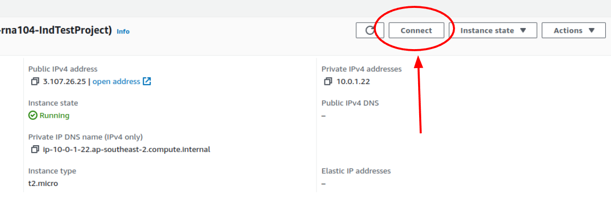
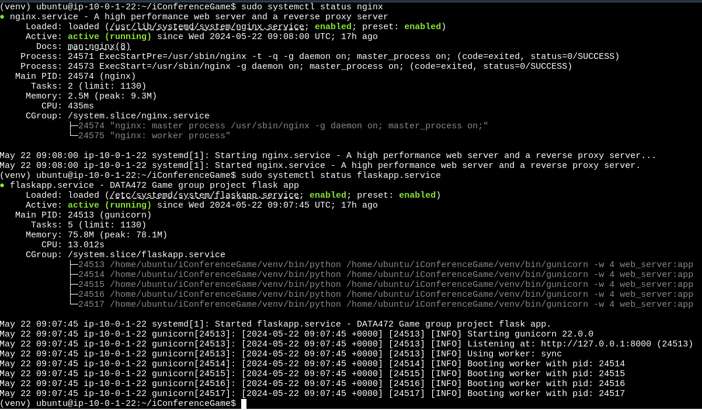
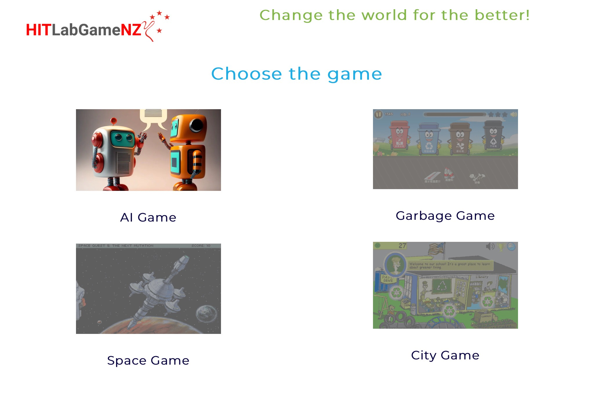
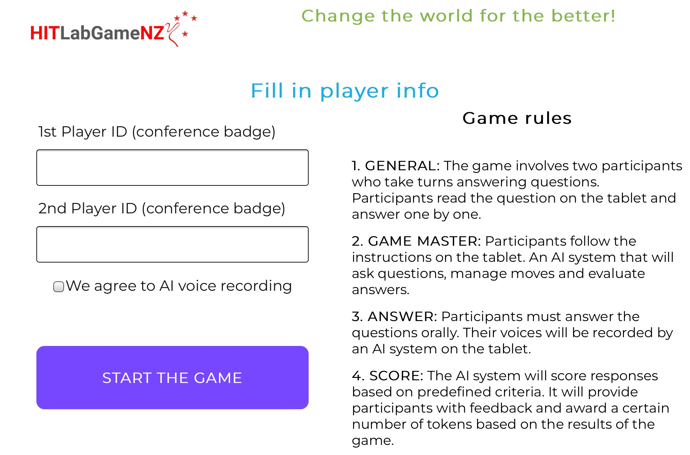
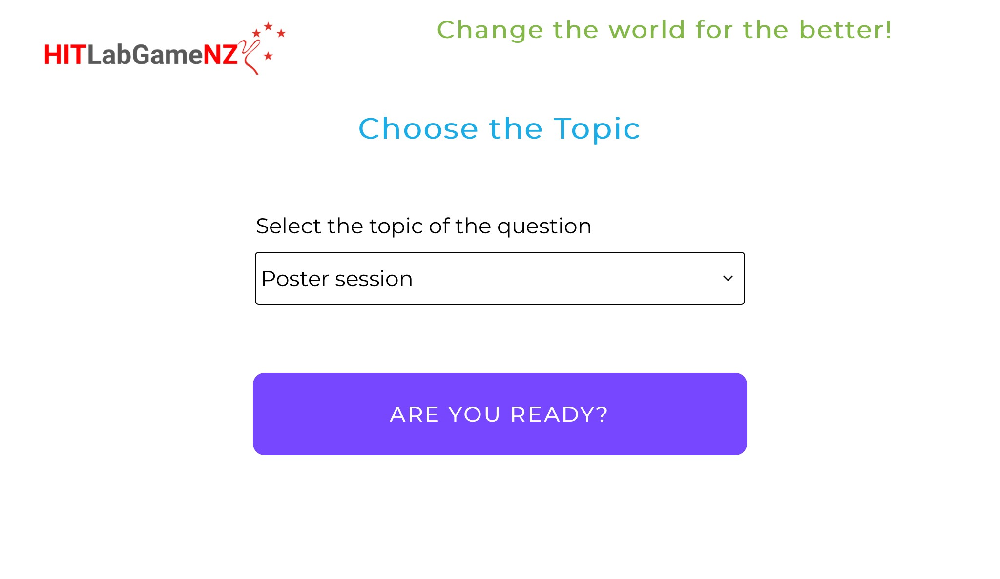
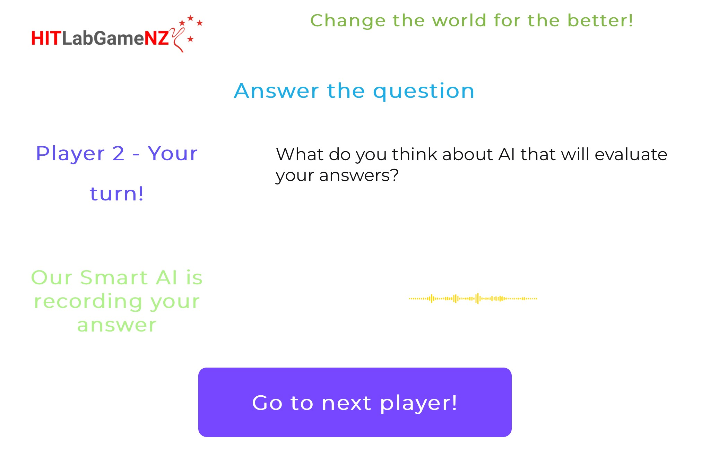
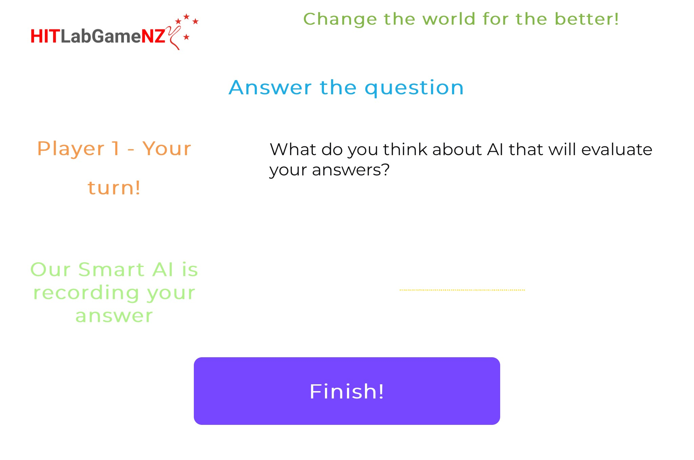
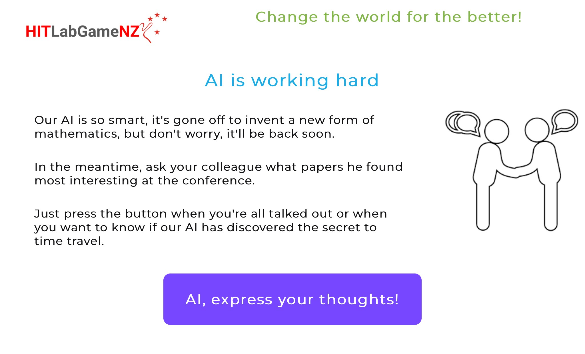
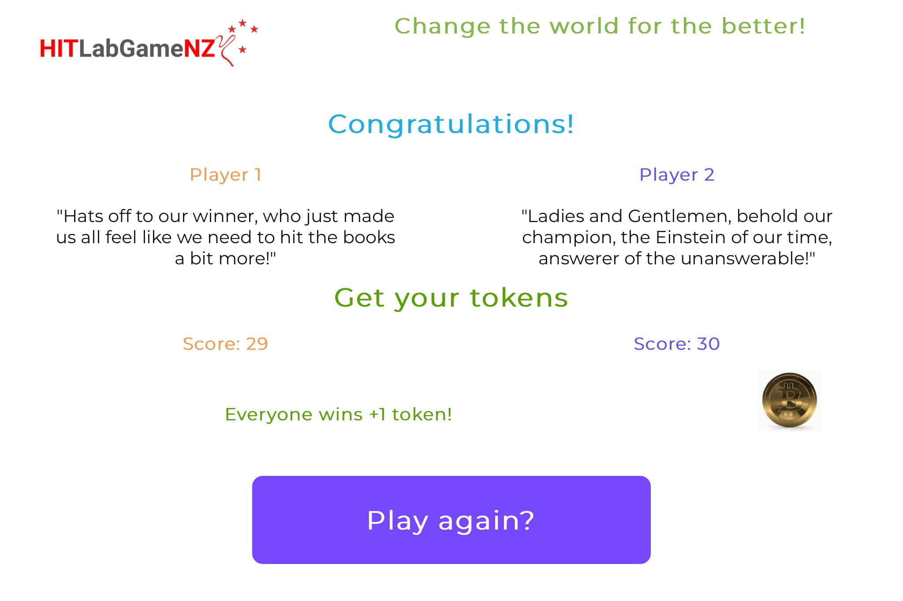

# Conference Mini Game Prototype for HITD603 course at the University of Canterbury

## Presentation

The presentation of our group project was available in the folder "Presentation"


## The pipeline how to deploy this web application into Amazon Cloud (AWS) is below


### 1. Clone this repository into `PATH-YOUR-LOCAL-DIRECTORY` on local computer

git clone https://github.com/romanaumov/Conference-Game-Prototype.git


### 2. Create a AWS EC2 instance

Basic information how to create and tune your EC2 instance you can find on the official AWS website here: https://docs.aws.amazon.com/AWSEC2/latest/UserGuide/EC2_GetStarted.html


### 3. AWS setup

1. To work with EC2 instance you should connect to this virtual environment. You can do it using `ssh` or just use AWS web interface to click the `Connect` button on the top right corner of EC2 instance page and select the tab `EC2 Instance Connect` by default, you will be able to connect to the instance without any further setup.



2. Copy the folder from `PATH-YOUR-LOCAL-DIRECTORY` to EC2 home directory running the command below on your local machine

```bash
cd <PATH-YOUR-LOCAL-DIRECTORY>/Conference-Game-Prototype
scp -i <PATH-TO-YOUR-PEM-KEY-ON-LOCAL-MACHINE> -r iConferenceGame ubuntu@<EC2-PUBLIC-IP-ADDRESS>:/home/ubuntu/
```


### 4. Set Flask app environment on EC2

1. Using bash on EC2 create the `venv` folder in the `iConferenceGame` folder and activate this environment using the following commands:
2. Enter to the folder `iConferenceGame` using the command `cd iConferenceGame`

```bash
sudo apt-get update
sudo apt install python3-virtualenv
virtualenv -p python3 venv
source venv/bin/activate
```

3. Install the required packages using the command: 

```bash
pip install requirements.txt
```

4. Finally, your app folder should be like the following:


### 5. Set Gunicorn environment on EC2

1. Copy a `flaskapp.service` file from `iConferenceGame` to the `/etc/systemd/system/` folder using the command 

```bash
sudo mv flaskapp.service /etc/systemd/system/
```

Note: If your EC2 instance image is not buntu, you should replace the `ubuntu` with the correct user name in the `flaskapp.service` file.

2. Enable the service by running the following command:

```bash
sudo systemctl start flaskapp
sudo systemctl enable flaskapp
```

### 6. Set Nginx environment on EC2 

1. Install nginx by running the following command:

```bash
sudo apt-get update
sudo apt-get install nginx
```

2. Start Nginx:

```bash
sudo systemctl start nginx
```

3. Enable Nginx reverse proxy by updating a file named `default` in the `/etc/nginx/sites-available/` folder. You should replace the IP address in the file with your `EC2-PUBLIC-IP-ADDRESS` IP address.

```bash
server {
        listen 80 default_server;
        listen [::]:80 default_server;

        root /var/www/html;
        index index.html index.htm index.nginx-debian.html;

        server_name <EC2-PUBLIC-IP-ADDRESS>;

        location / {
                proxy_pass         http://127.0.0.1:8000/;
                proxy_redirect     off;

                proxy_set_header   Host                 $host;
                proxy_set_header   X-Real-IP            $remote_addr;
                proxy_set_header   X-Forwarded-For      $proxy_add_x_forwarded_for;
                proxy_set_header   X-Forwarded-Proto    $scheme;
        }
}
```

4. Restart Nginx by running the following command:

```bash
sudo systemctl restart nginx
```



Now the game will be avalable at the EC2 public IP address from the browser. `http://<EC2-PUBLIC-IP-ADDRESS>`


### 7. Workflow of the Conference Mini Game

You can see the workflow (screenshots) of the Conference Mini Game below










## Conclusion

This Mini Game is one of the part of our group prototype at the HITD603 course. Another parts of full Conference Game prototype include Arduino and Unreal Engine technologies. The whole Conference Game prototype was developed from scratch (from idea to implementation) within 2.5 weeks. If you have any questions, please feel free to ask me.